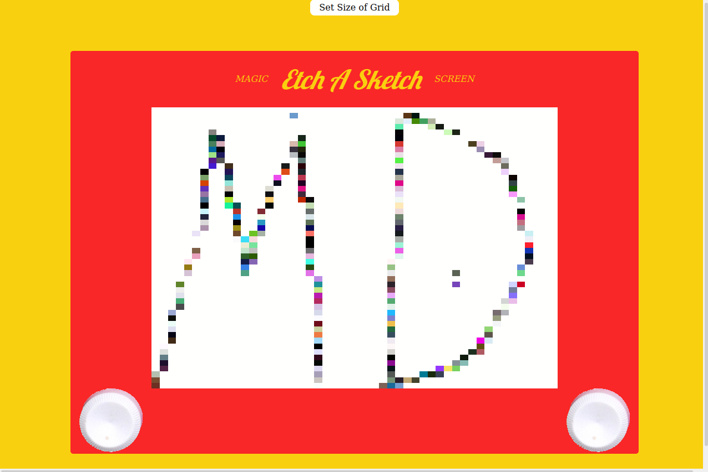

# Readme
# Etch A Sketch App

## Overview

A little toy.... something between an Etch-A-Sketch and a sketchpad.  It's magic!

### Challenge

The project requirements can be found [here](https://www.theodinproject.com/paths/full-stack-javascript/courses/javascript/lessons/library) in The Odin Project's
curriculum.  I opted to add a special feature which transforms the color of each
"pixel" from it's random-generated start value to black, getting 10% darker 
with each pass of the mouse.

### Screenshot

  

### Links

- [Live site](https://mattdimicelli.github.io/No_Framework_Etch_a_Sketch/)
- [Repo](https://github.com/mattdimicelli/No_Framework_Etch_a_Sketch/)

## My process

### Built with

- Vanilla JS, CSS, and HTML.
- The New CSS Reset, which removes all default browser styles except for the "display" property
- Google Font Service
- CSS Flexbox and Grid

### What I learned

This project was done early on in my learning, so it was my first time practicing
many basics.  Over the months as I got better at coding, I refactored the app a 
bit, foregoing doing a complete do-over.  

One challenge that I enjoyed was figuring out how to make the "pixels" ten 
percent darker with each pass of the mouse.  Since a previous version of this 
app generated random RGB colors, I erroneously decided to tackle this problem 
by first trying to convert the RGB color to a HSL color.  After being stumped for
a few minutes, I realized that conversion of color types is *not* simple **at 
all**.  In the end I decided to start with a HSL color, and my appreciation for 
the advantages of HSL colors grew.
